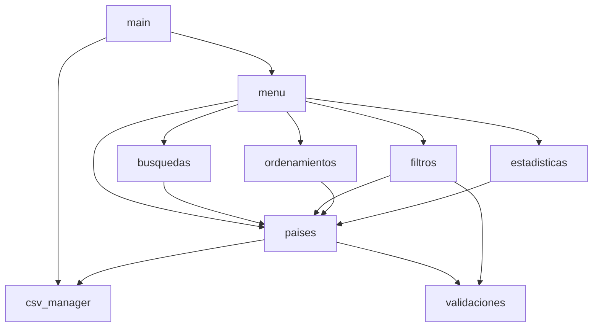

# Plan de implementación — `feature/core-functionality`

> Plan de trabajo para la rama `feature/core-functionality`.
> Objetivo: completar **toda la funcionalidad pendiente** del TPI sin reescribir lo que ya funciona.
> Este documento es solo un plan; la implementación se hace en commits posteriores dentro de la misma rama.

---

## 1. Contexto

### 1.1 Estado actual del repositorio

```
TPI_Programacion1/
├── data/paises.csv
├── src/
│   ├── main.py          (arranca y delega en menu)
│   ├── menu.py          (mostrar_menu, leer_opcion, ejecutar_opcion, ejecutar_menu)
│   ├── csv_utils.py     (cargar_paises, guardar_paises, agregar_pais)
│   ├── busquedas.py     (buscar_pais, mostrar_paises)
│   └── filtros.py       (filtrar_por_continente, filtrar_por_poblacion, filtrar_por_superficie)
└── docs/
```

### 1.2 Funcionalidad ya implementada

- Opción 1: agregar país (en `csv_utils.py`).
- Opción 2: buscar país por nombre (parcial, insensible a mayúsculas).
- Opción 3: filtrar por continente.
- Opción 4: filtrar por rango de población.
- Opción 5: filtrar por rango de superficie.
- Opción 0: salir.

### 1.3 Funcionalidad pendiente (objetivo de esta rama)

- **Opción 6:** actualizar país (cambiar población y superficie).
- **Opción 7:** ordenar países (nombre / población / superficie, asc/desc).
- **Opción 8:** estadísticas (mayor/menor población, promedio población, promedio superficie, conteo por continente).

### 1.4 Mejoras de calidad seleccionadas para esta rama

Tomadas de `docs/informe_mejoras_pendientes.md`. Se incluyen porque son baratas y elevan el puntaje en II.3 (modularidad), II.6 (legibilidad), II.7 (manejo de errores):

- **#1**: mover `mostrar_paises` desde `busquedas.py` a `paises.py`.
- **#2**: mover `agregar_pais` desde `csv_utils.py` a `paises.py`. Renombrar `csv_utils.py` → `csv_manager.py` dejando solo `cargar_paises` y `guardar_paises`.
- **#3**: extraer validaciones repetidas a `validaciones.py`.
- **#9**: reemplazar `except Exception` por excepciones específicas (`OSError`, `csv.Error`, `ValueError`).
- **#11**: unificar prefijos de mensajes (`ERROR:`, `ADVERTENCIA:`, `OK:`) y arreglar `MODULO PENDIENTE,Actualizar pais.` (coma sin espacio).

Mejoras **descartadas** explícitamente para esta rama (quedan en el informe de pendientes):
- #6 formato visual de `mostrar_paises`: lo arreglamos al moverla a `paises.py`, pero sin agregar features.
- #7 normalización de tildes en filtros: opcional, agrega `unicodedata`. Decisión: **no incluir** para no agregar superficie.
- #8 rangos negativos en filtros: lo cubre indirectamente la nueva `validar_rango`.
- #10 reescritura completa del CSV: se mantiene.

---

## 2. Archivos a crear

| Archivo | Responsabilidad | Justificación |
|---|---|---|
| `src/paises.py` | Operaciones de dominio sobre la lista de países: `agregar_pais`, `actualizar_pais`, `mostrar_paises`. | Aísla el dominio de la persistencia. Cubre la opción 6 y reubica `mostrar_paises`. |
| `src/validaciones.py` | Helpers de entrada validada: `pedir_entero`, `pedir_entero_no_negativo`, `pedir_texto_no_vacio`, `validar_rango`. | Elimina duplicación entre alta, actualización y filtros. |
| `src/ordenamientos.py` | `ordenar_paises(paises, criterio, ascendente)` y orquestación de la opción 7. | Cubre la opción 7. |
| `src/estadisticas.py` | `pais_mayor_poblacion`, `pais_menor_poblacion`, `promedio_poblacion`, `promedio_superficie`, `cantidad_por_continente`, `mostrar_estadisticas`. | Cubre la opción 8. |

---

## 3. Archivos a modificar

| Archivo | Cambio | Notas |
|---|---|---|
| `src/csv_utils.py` → renombrar a `src/csv_manager.py` | Quitar `agregar_pais`. Dejar solo `cargar_paises` y `guardar_paises`. Reemplazar `except Exception` por `except (OSError, csv.Error)` en lectura y `except OSError` en escritura. | Conserva el cálculo de `RUTA_CSV` desde `__file__` ya implementado. |
| `src/busquedas.py` | Quitar `mostrar_paises` (se mueve a `paises.py`). Importar `mostrar_paises` desde `paises`. Cambiar prefijo `ERROR,` → `ERROR:`. | Sin cambios de lógica de búsqueda. |
| `src/filtros.py` | Reemplazar las llamadas duplicadas a `int(input(...))` por `pedir_entero` (de `validaciones.py`). Reemplazar la importación de `mostrar_paises`: ahora desde `paises`. Unificar prefijo `ERROR:`. | Mantiene la semántica: rangos inclusivos `min <= x <= max`. |
| `src/menu.py` | Conectar opciones 6, 7 y 8 a las funciones reales. Importar de `paises`, `ordenamientos`, `estadisticas`. Importar `agregar_pais` desde `paises` (no desde `csv_utils`). Unificar prefijos `ERROR:` y arreglar `MODULO PENDIENTE,Actualizar pais.` (queda obsoleto al implementar la opción). | Una vez que las 3 opciones tengan implementación real, ya no quedan placeholders. |
| `src/main.py` | Cambiar import: `from csv_manager import cargar_paises`. Unificar prefijo `ADVERTENCIA:` (ya está en ese formato — verificar). | Mínimo. |

---

## 4. Dependencias entre módulos



Reglas:
- **`paises.py` es la utilidad central de presentación** (`mostrar_paises`) y dominio (alta, actualización).
- **`validaciones.py` no importa nada del proyecto**: solo `input()` y la stdlib.
- **`csv_manager.py` no importa nada del proyecto**: solo `csv` y `os`.
- **No hay imports circulares**: cada módulo de feature (busquedas, filtros, ordenamientos, estadisticas) importa de `paises`, nunca al revés.

---

## 5. Orden de implementación recomendado

Cada hito termina con un commit y el programa **debe seguir corriendo** (`python src/main.py`).

### Hito A — Andamiaje de validaciones y persistencia
1. Crear `src/validaciones.py` con `pedir_entero`, `pedir_entero_no_negativo`, `pedir_texto_no_vacio`, `validar_rango`.
2. Renombrar `src/csv_utils.py` → `src/csv_manager.py` (con `git mv`).
3. Ajustar imports en `src/main.py` y `src/menu.py` para que sigan apuntando a las funciones existentes.
4. **No** quitar `agregar_pais` de `csv_manager.py` todavía: el menú lo sigue importando.

> Resultado: el programa funciona igual que antes, pero ya existen los módulos base.

### Hito B — Crear `src/paises.py`
1. Crear `src/paises.py`.
2. Mover `mostrar_paises` desde `busquedas.py` a `paises.py`.
3. Mover `agregar_pais` desde `csv_manager.py` a `paises.py`. Refactor mínimo: usa `pedir_texto_no_vacio` y `pedir_entero_no_negativo`.
4. Implementar `actualizar_pais(paises)`: pide nombre (parcial o exacto), si se encuentra exactamente uno permite cambiar población y superficie usando `validaciones.py`, persiste con `guardar_paises`.
5. Actualizar imports en `busquedas.py`, `filtros.py`, `menu.py`.
6. **Quitar** `agregar_pais` de `csv_manager.py`.
7. Conectar la opción 6 del menú a `actualizar_pais`.

> Resultado: opciones 1, 2, 3, 4, 5 y **6** funcionando.

### Hito C — Crear `src/ordenamientos.py`
1. Crear `src/ordenamientos.py` con:
   - `ordenar_paises(paises, criterio, ascendente)`: usa `sorted` de Python con `key=lambda` por `nombre`, `poblacion` o `superficie`.
   - `pedir_criterio_orden()`: muestra submenú (1=nombre, 2=población, 3=superficie) y devuelve la clave correspondiente.
   - `pedir_direccion()`: pregunta asc/desc y devuelve un booleano.
   - `flujo_ordenar(paises)`: orquesta el submenú y muestra resultados con `mostrar_paises`.
2. Conectar la opción 7 del menú a `flujo_ordenar`.

> Resultado: opción **7** funcionando.

### Hito D — Crear `src/estadisticas.py`
1. Crear `src/estadisticas.py` con funciones puras:
   - `pais_mayor_poblacion(paises)` → dict.
   - `pais_menor_poblacion(paises)` → dict.
   - `promedio_poblacion(paises)` → float (entero al imprimir).
   - `promedio_superficie(paises)` → float.
   - `cantidad_por_continente(paises)` → dict `{continente: cantidad}`.
2. Función orquestadora `mostrar_estadisticas(paises)` que las llama y formatea la salida en consola, manejando el caso "lista vacía" sin dividir por cero.
3. Conectar la opción 8 del menú.

> Resultado: opción **8** funcionando. Las 8 opciones del menú están operativas.

### Hito E — Pulido y unificación
1. Unificar prefijos: `ERROR:` (con dos puntos y espacio), `ADVERTENCIA:`, `OK:`. Hacer una pasada por `menu.py`, `paises.py`, `csv_manager.py`, `validaciones.py`, `busquedas.py`, `filtros.py`, `ordenamientos.py`, `estadisticas.py`.
2. Reemplazar `except Exception` por excepciones específicas en `csv_manager.py`.
3. Revisión final: docstrings cortas en cada función nueva, sin comentarios redundantes, líneas razonables.

> Resultado: rama lista para PR.

---

## 6. Detalle por módulo nuevo

### 6.1 `src/validaciones.py`

```python
def pedir_texto_no_vacio(mensaje):
    """Pide un texto al usuario y rechaza si esta vacio."""

def pedir_entero(mensaje):
    """Pide un entero. Devuelve None si la entrada no es valida."""

def pedir_entero_no_negativo(mensaje):
    """Pide un entero >= 0. Devuelve None si la entrada no es valida."""

def validar_rango(minimo, maximo):
    """Valida que minimo <= maximo y ambos no negativos. Devuelve True/False."""
```

Reglas:
- Devuelve `None` (no lanza excepciones hacia arriba) cuando la entrada del usuario es inválida; quien llama decide qué hacer.
- Imprime mensajes de error con prefijo `ERROR:`.

### 6.2 `src/paises.py`

```python
def mostrar_paises(lista):
    """Imprime una lista de paises en formato tabular."""

def agregar_pais(paises):
    """Pide datos al usuario, valida, agrega el pais y persiste el CSV."""

def actualizar_pais(paises):
    """Busca un pais por nombre y permite cambiar su poblacion y/o superficie."""
```

`actualizar_pais` flujo:
1. Pide `nombre` con `pedir_texto_no_vacio`.
2. Busca coincidencia case-insensitive **exacta**. Si hay 0 o más de 1, error claro.
3. Pregunta nueva población (entrada vacía → mantener).
4. Pregunta nueva superficie (entrada vacía → mantener).
5. Si hubo cambios, llama a `guardar_paises`.

### 6.3 `src/ordenamientos.py`

```python
def ordenar_paises(paises, criterio, ascendente):
    """Devuelve una nueva lista ordenada por 'nombre', 'poblacion' o 'superficie'."""

def flujo_ordenar(paises):
    """Submenu interactivo que pide criterio y direccion, y muestra el resultado."""
```

- Usa `sorted(paises, key=lambda p: p[criterio], reverse=not ascendente)`.
- Para `nombre`, comparación insensible a mayúsculas con `str.casefold()`.
- No modifica la lista original.

### 6.4 `src/estadisticas.py`

```python
def pais_mayor_poblacion(paises): ...
def pais_menor_poblacion(paises): ...
def promedio_poblacion(paises): ...
def promedio_superficie(paises): ...
def cantidad_por_continente(paises): ...
def mostrar_estadisticas(paises):
    """Muestra todas las estadisticas en pantalla. Maneja lista vacia."""
```

- `cantidad_por_continente` itera y arma `dict` (sin `collections.Counter` para mantener la solución dentro de lo enseñado en la materia).
- Si `paises` está vacío: `mostrar_estadisticas` imprime `"ADVERTENCIA: No hay paises cargados."` y retorna.

---

## 7. Riesgos y cómo mitigarlos

| Riesgo | Mitigación |
|---|---|
| **Romper `python src/main.py`** al renombrar `csv_utils.py` o mover funciones. | Usar `git mv` y hacer un commit por hito. Probar manualmente después de cada hito antes de seguir. |
| **Imports circulares** entre `paises` y `busquedas`/`filtros`. | Regla: `paises.py` no importa de `busquedas.py` ni de `filtros.py`. Solo al revés. |
| **División por cero** en estadísticas con lista vacía. | `mostrar_estadisticas` valida `if not paises:` al inicio. |
| **Cambio de comportamiento** en alta de país al usar `validaciones.py`. | `agregar_pais` mantiene exactamente las mismas reglas: nombre no vacío, no duplicado, población ≥ 0, superficie > 0, continente no vacío. |
| **Confusión entre `csv_utils` y `csv_manager`** durante la transición. | Hacer el rename y los ajustes de imports en un solo commit del Hito A. No dejar ambos nombres conviviendo. |
| **Encoding al guardar** por tildes (`América`). | Mantener `encoding="utf-8"` en `guardar_paises` y `cargar_paises` (ya está). Probar agregar un país con tilde antes del PR. |
| **Ordenamiento por nombre con tildes** (`América` < `Brasil`). | Usar `str.casefold()` como `key` para nombre. No es perfecto pero es lo enseñado. |
| **Actualización ambigua** si el usuario escribe un nombre parcial que coincide con varios países. | Pedir nombre exacto y rechazar resultados ambiguos con mensaje claro. |
| **Accidentalmente perder mejoras** del informe de pendientes. | Al final del Hito E, marcar en `informe_mejoras_pendientes.md` qué observaciones quedaron resueltas. |

---

## 8. Commits sugeridos

Uno por hito, con mensajes en español (consistente con el commit anterior).

```
1. refactor(validaciones): crear src/validaciones.py con helpers de entrada

2. refactor(csv): renombrar csv_utils.py a csv_manager.py

3. feat(paises): crear src/paises.py con mostrar_paises, agregar_pais y actualizar_pais

   - Mover mostrar_paises desde busquedas.py.
   - Mover agregar_pais desde csv_manager.py.
   - Implementar actualizar_pais (opcion 6).
   - Conectar opcion 6 del menu.

4. feat(ordenamientos): implementar ordenar paises por nombre, poblacion y superficie

   - Crear src/ordenamientos.py con ordenar_paises y flujo_ordenar.
   - Soporte ascendente/descendente.
   - Conectar opcion 7 del menu.

5. feat(estadisticas): implementar estadisticas de paises

   - Crear src/estadisticas.py con mayor/menor poblacion, promedios y conteo por continente.
   - Conectar opcion 8 del menu.

6. refactor(mensajes): unificar prefijos y excepciones especificas

   - ERROR:, ADVERTENCIA:, OK: con formato consistente.
   - Reemplazar except Exception por except especificos en csv_manager.py.
   - Pequena mejora de espaciado en mostrar_paises.

Refs: PLAN_DESARROLLO.md Pasos 3, 4, 5 y 6.
```

---

## 9. Pruebas manuales por hito

Ejecutar siempre desde la raíz: `python src/main.py`.

### Después del Hito A (validaciones + rename CSV)
- [ ] El programa arranca y muestra el menú.
- [ ] Las opciones 1–5 funcionan exactamente igual que antes.
- [ ] No hay restos de `csv_utils.py` (ni en disco ni en imports).
- [ ] `python -c "from validaciones import pedir_entero"` no rompe.

### Después del Hito B (paises.py + opción 6)
- [ ] Opción 1: agregar país nuevo "Chile / 19000000 / 756102 / América" persiste y aparece en `data/paises.csv`.
- [ ] Opción 1: rechazar duplicado "Argentina".
- [ ] Opción 1: rechazar población negativa.
- [ ] Opción 6: actualizar "Argentina", cambiar población a `46000000`, dejar superficie igual (Enter). Verificar persistencia.
- [ ] Opción 6: nombre inexistente → mensaje claro de error.
- [ ] Opción 6: nombre que coincide parcialmente con varios → mensaje claro o pedir nombre exacto.
- [ ] Opciones 2, 3, 4, 5 siguen funcionando.

### Después del Hito C (ordenamientos)
- [ ] Opción 7 → criterio nombre asc → primer país: "Alemania" (o "Argentina" según el dataset cargado).
- [ ] Opción 7 → criterio nombre desc → primero: el último alfabético.
- [ ] Opción 7 → criterio población asc → primero: país de menor población.
- [ ] Opción 7 → criterio población desc → primero: India (1.380.004.385).
- [ ] Opción 7 → criterio superficie desc → primero: Brasil (8.515.767).
- [ ] Opción 7 → entrada inválida en submenú → mensaje claro y vuelve al menú principal.

### Después del Hito D (estadísticas)
- [ ] Opción 8 muestra:
  - País con mayor población: India.
  - País con menor población: Australia.
  - Promedio población: ≈ 268M (calcular sobre el dataset actual).
  - Promedio superficie: valor coherente.
  - Conteo por continente: América=2 (o 3 si se agregó Chile), Asia=2, Europa=2, África=1, Oceanía=1.
- [ ] Con CSV vacío (probar moviendo temporalmente el archivo): la opción 8 muestra `ADVERTENCIA: No hay paises cargados.` sin caer.

### Después del Hito E (pulido)
- [ ] Todos los mensajes de error empiezan con `ERROR: ` (espacio incluido).
- [ ] Todas las advertencias con `ADVERTENCIA: `.
- [ ] Todos los mensajes de éxito con `OK: `.
- [ ] No queda ningún `MODULO PENDIENTE`.
- [ ] El programa completo se puede recorrer de punta a punta sin caídas.

---

## 10. Definición de "rama lista para mergear"

- [ ] Hitos A, B, C, D y E completos.
- [ ] Las 9 opciones del menú (0 a 8) responden con la funcionalidad real.
- [ ] No queda código muerto ni `MODULO PENDIENTE`.
- [ ] `informe_mejoras_pendientes.md` actualizado: marcar como resueltas #1, #2, #3, #9 y #11.
- [ ] `objetivo_nota_maxima.md` con los ítems II.1, II.3, II.5, II.7 marcados con evidencia.
- [ ] `python src/main.py` corre sin errores en una sesión completa que toca las 9 opciones.
- [ ] Ningún archivo nuevo bajo `src/` supera, idealmente, las ~120 líneas.
